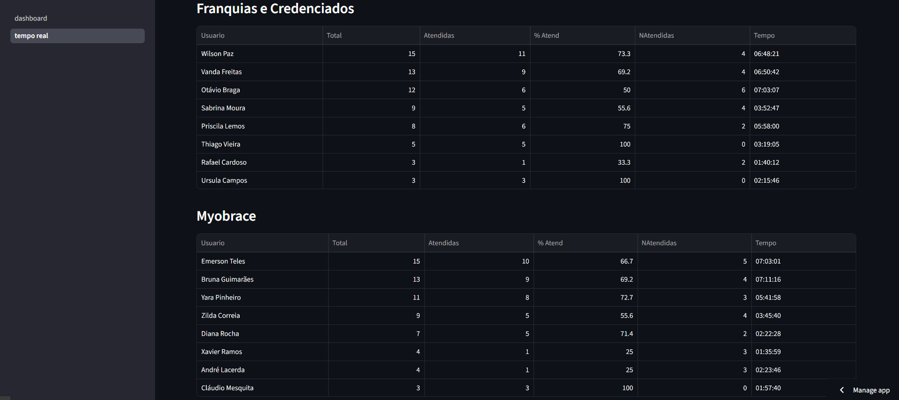

# 3CX Dashboard — Ligações por Setor

Automação completa para extração e visualização de relatórios de ligações do 3CX (PABX em nuvem).

## O que faz

- **coletor_historico.py** — bot Selenium que faz login no 3CX, aplica filtro de data (ontem) e baixa o relatório CSV de chamadas
- **coletor_tempo_real.py** — bot Selenium que baixa sempre o relatório mais recente sem filtro de data, para exibição contínua
- **dashboard.py** — dashboard Streamlit com seletor de relatório, exibe ligações por colaborador agrupadas por setor
- **pages/tempo_real.py** — página adicional que sempre exibe o arquivo mais recente automaticamente

## Stack

Python · Selenium · Streamlit · Pandas · python-dotenv

## Como rodar localmente

1. Clone o repositório
2. Instale as dependências: pip install -r requirements.txt
3. Copie o .env.example para .env e preencha com suas credenciais
4. Para gerar dados de demonstração: python gerar_dados_mock.py
5. Para rodar o dashboard: streamlit run dashboard.py
6. Para rodar o coletor histórico: python coletor_historico.py
7. Para rodar o coletor tempo real: python coletor_tempo_real.py

## Estrutura

- coletor_historico.py — Automação Selenium com filtro por data
- coletor_tempo_real.py — Automação Selenium sem filtro de data
- dashboard.py — Dashboard Streamlit com seletor de arquivo
- pages/tempo_real.py — Página de visualização em tempo real
- gerar_dados_mock.py — Gerador de dados fictícios para demo
- requirements.txt
- .env.example — Template de variáveis de ambiente
- data/ — Relatórios baixados (ignorado pelo git)

## Preview

